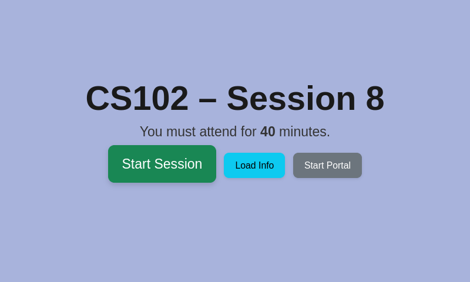
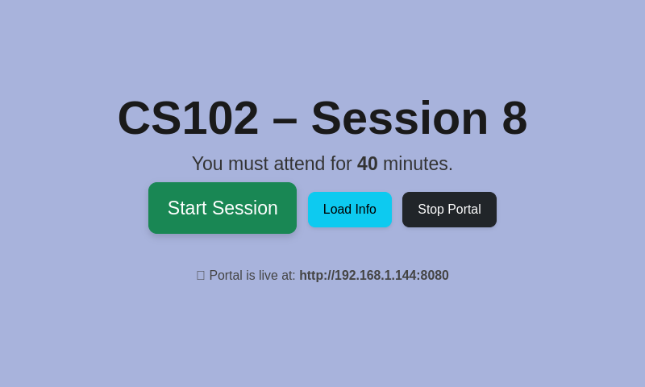
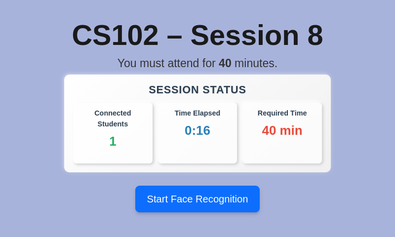
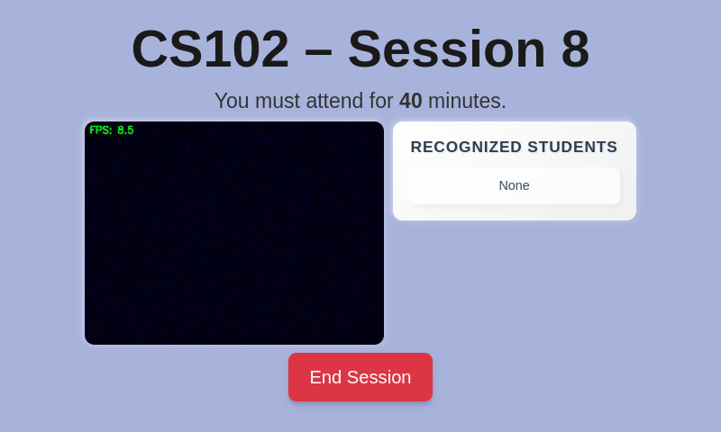
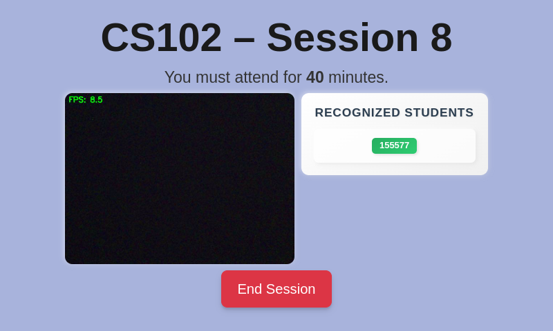

# 🌐 IpBeep - Smart Attendance System

IpBeep is a Raspberry Pi-powered smart attendance system that combines Wi-Fi-based connectivity logging with real-time face recognition. It provides an automated and verifiable attendance system designed for classrooms using a combination of a local Flask-based UI and Firebase for cloud data sync.

---

## 🔧 How the System Works

1. **Hotspot Creation**: Raspberry Pi creates a Wi-Fi hotspot (SSID: `IpBeep-Network`) using `hostapd` and `dnsmasq`.
2. **Student Registration**: Students connect to the hotspot and access a captive portal (`http://192.168.4.1:8080`) to register. Info such as name, student ID, IP, MAC, and photo are saved in `attendance_submissions.csv`.
3. **Session Configuration**:
    - Instructor writes session info (course ID, session ID, threshold) to Firebase Firestore.
    - Pi UI has a "Load Info" button that fetches session config from Firestore and writes it locally to `session_config.json`.
4. **Attendance Tracking**:
    - When "Start Session" is clicked, MAC address tracking (`full_log.py`) begins.
    - When "Start Face Recognition" is clicked, MAC tracking stops and face recognition (`run_recognition_stream.py`) begins.
5. **Log Upload**:
    - After "End Session", logs are finalized and synced to Firebase under the correct `sessions/{course_session}` document.

---

## 🧠 Project Highlights

- 🔐 **Dual Validation**: Tracks both MAC address presence and facial recognition.
- 📡 **No Internet Needed**: Works fully offline using the Pi hotspot and portal.
- 🧠 **Face Recognition**: Uses stored face encodings and Picamera2 + OpenCV.
- 🔥 **Firebase Sync**: All logs and session metadata are pushed to Firestore.
- 🎛 **Control Panel**: Local touchscreen-friendly Flask UI (`class_control.py`).
- 📁 **Session Config**: Lightweight format with only `course_id`, `session_id`, `threshold_minutes`.

---

## 🖥 UI Screenshots

<table>
  <tr>
    <td align="center"><strong>Home Screen</strong><br></td>
    <td align="center"><strong>Start Portal</strong><br></td>
  </tr>
  <tr>
    <td align="center"><strong>Session Tracking</strong><br></td>
    <td align="center"><strong>Start Recognition</strong><br></td>
  </tr>
  <tr>
    <td align="center"><strong>Recognized Student</strong><br></td>
    <td></td>
  </tr>
</table>

---

## 🏗️ Architectural Refactoring

This project recently underwent a significant refactoring to improve its structure, maintainability, and clarity. The key changes include:

- **Decoupling of Services**: The monolithic `class_control.py` was broken down by extracting specific responsibilities into dedicated modules.
  - **Firebase Service**: All Firestore database operations (uploading logs, fetching configurations) were moved into a new `firebase_service.py`. This separates the core application logic from the database implementation.
- **Elimination of Redundant & Obsolete Code**: The codebase was cleaned by removing unused and confusing scripts.
  - Deleted `sync_to_firebase.py` as its functionality is now handled by `firebase_service.py`.
  - Deleted `run_recognition.py` and `track_connections.py` which were obsolete or for testing purposes.
  - Removed the `trash/` directory containing old test assets.

This refactoring makes the project easier to understand, debug, and extend in the future.

---

## 🗂 Directory and File Overview

| File / Folder                | Description |
|-----------------------------|-------------|
| `class_control.py`          | Flask UI for managing the session (Start, Stop, Face Rec). Delegates backend tasks. |
| `firebase_service.py`       | Handles all communication with Firebase Firestore (uploading logs, fetching configs). |
| `portal.py`                 | Captive portal for student registration. |
| `full_log.py`               | Tracks student attendance based on MAC address presence. |
| `run_recognition_stream.py` | Recognizes faces from live camera feed; updates JSON log. |
| `encode_faces.py`           | Converts captured student images into facial encodings. |
| `firebase_key.json`         | 🔐 Secret Firebase service key (excluded from repo). |
| `session_config.json`       | Local config written from Firestore (course_id, session_id, threshold). |
| `logs/`                     | Folder containing per-course logs for each session. |
| `captures/`                 | Folder where student registration photos are saved. |
| `registration.json`         | Local copy of registered students. |
| `attendance_submissions.csv`| Registration submissions stored from portal. |
| `Config/`                   | Backup of modified Pi config files (dhcpcd.conf, dnsmasq.conf, hostapd.conf). |
| `requirements.txt`          | Python libraries required. |
| `start_hotspot.sh`          | Shell script to start the hotspot manually. |
| `encodings.pkl`             | Binary file storing face encodings. |

---

## 📂 Firebase Structure

### 🔹 Collection: `sessions`
- **Document ID**: e.g. `CS2_12`
- Fields:
  - `course_id`: `"CS2"`
  - `session_id`: `"12"`
  - `students`: Map of student_id → student attendance info
  - Each student entry includes:
    - `mac`, `ip`, `name`, `total_minutes`, `attended`, `face`, `threshold`, `start`, `last_seen`

### 🔹 Collection: `session_config`
- Each document represents a new session setup from the website.
- Fields:
  - `course_id`: `"CS2"`
  - `session_id`: `"12"`
  - `threshold_minutes`: `5`

### 🔹 Collection: `instructors`
- Each document ID is the instructor's email or unique key.
- Fields:
  - `name`
  - `email`
  - `courses`: array of course codes, e.g., `["CS2", "CS3"]`

---

## ⚙ Raspberry Pi Config Files

Stored in `Config/` folder for documentation:
- `dhcpcd.conf`:
  ```
  interface wlan0
      static ip_address=192.168.4.1/24
      nohook wpa_supplicant
  ```
- `dnsmasq.conf`:
  ```
  interface=wlan0
  dhcp-range=192.168.4.10,192.168.4.50,255.255.255.0,24h
  address=/#/192.168.4.1
  ```
- `hostapd.conf`:
  ```
  interface=wlan0
  driver=nl80211
  ssid=IpBeep-Network
  hw_mode=g
  channel=6
  wmm_enabled=0
  macaddr_acl=0
  auth_algs=1
  ignore_broadcast_ssid=0
  ```

---

## 🚀 Setup Guide

```bash
# Clone the project
git clone https://github.com/HaithamGhaith/IpBeep-PI-Side.git
cd IpBeep-PI-Side

# Install system dependencies
sudo apt-get update
sudo apt-get install hostapd dnsmasq

# Install Python libraries
pip install -r requirements.txt
```

Place your `firebase_key.json` in the root directory.

---

## 🧪 Local Testing

- To test camera:
  ```bash
  python3 test_camera.py
  ```
- To encode faces after registration:
  ```bash
  python3 encode_faces.py
  ```

---

## 📌 Notes

- All Firebase secrets and `.pkl` files are excluded via `.gitignore`.
- `Config/` folder is for documentation only — not active unless copied to `/etc/...`.
- Recommended commit: `Initial full project upload with control panel, portal, and recognition modules.`

---

Built by Haitham Ghaith & Khalid Barham — 2025
